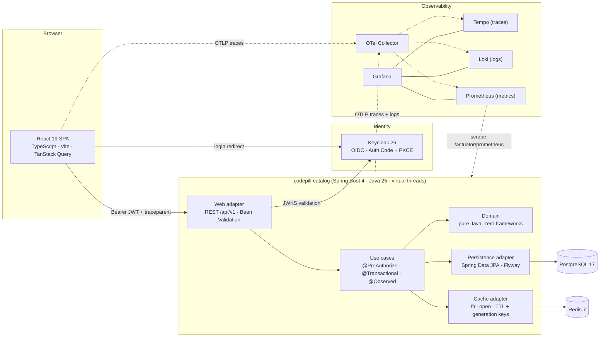

# 💊 CodePill — Microlearning, engineered like it's going to production tomorrow

[](https://github.com/pedrovvitor/CodePill/actions/workflows/main.yml)


**CodePill** is a mobile-first microlearning platform: authors write short, focused learning "pills", curators publish them, and learners scroll a TikTok-style vertical feed. Small product — deliberately. The product is simple **so the engineering can be uncompromising**.

This repository demonstrates what "production-ready" actually means, end to end:

- **A vertical slice that works** — OAuth2 login → authoring → curation → an infinite feed, covered by Playwright journeys against a real Keycloak + Postgres + Redis stack.
- **Failure-mode engineering, not happy-path demos** — every external call has a timeout, the cache fails open *fast*, evictions are transaction-aware, write endpoints are rate-limited, and a degraded Redis cannot take the database down with it.
- **Observability as a first-class requirement** — every request is traceable from a browser click to the SQL statement it triggered, with logs, traces, and metrics correlated by `trace_id`.
- **Governance you can read** — mandatory engineering standards live in [`docs/standards/`](docs/standards), every change is logged in [`STATE_OF_THE_APP.md`](docs/standards/STATE_OF_THE_APP.md), and the rules are *executable* (ArchUnit, coverage gates, security scanners — the build fails, not the reviewer's patience).

## 🏗 Architecture

Clean/Hexagonal Architecture on both sides of the wire: framework-free domain, use cases behind ports, adapters at the edges — enforced by ArchUnit (backend) and `eslint-plugin-boundaries` (frontend).



One trace id follows a request through every box above — click a slow span in Tempo and jump straight to its logs in Loki.

## ⚙️ Key engineering features

**Architecture & correctness**
- **Clean Architecture, mechanically enforced**: the domain module compiles against the JDK only; dependency direction, adapter isolation, and even `@Transactional` placement are ArchUnit rules that fail the build.
- **TDD as workflow, not aspiration**: red → green → refactor, with a **hard ≥85% line *and* branch coverage gate** per module (JaCoCo + Vitest). Domain/application sit near 100%.
- **Contract-first API**: OpenAPI 3.1 is the source of truth; frontend types are generated from it (`pnpm generate:api`) — no hand-written duplicates to drift.
- **Real-infrastructure tests**: Testcontainers Postgres/Redis (H2 is banned), Flyway migrations exercised on every build, a full 401/403/2xx security matrix per endpoint, and 6 Playwright journeys through the real UI + IdP.

**Resiliency & performance**
- **Fail-open Redis caching that fails *fast***: 250 ms command timeouts, TTL'd pill/feed entries, O(1) full-feed invalidation via a generation counter — a dead Redis degrades reads to Postgres instead of stalling them.
- **Transaction-aware cache eviction**: evictions run `afterCommit`, closing the stale-repopulation race and keeping Redis round-trips off the DB connection's critical path.
- **Timeouts everywhere**: Hikari pool sized explicitly with leak detection, server-side `statement_timeout`, bounded JWKS fetches to the IdP, 15 s fetch timeout in the SPA.
- **Read-optimized schema, proven under load**: partial + covering + GIN indexes designed for the feed, validated with `EXPLAIN ANALYZE` against a 100k-pill seed (sub-millisecond hot paths).

**Security**
- **OAuth2/OIDC done properly**: Authorization Code + PKCE only (implicit & password grants disabled), asymmetric JWTs with audience validation, tokens held **in memory** in the SPA.
- **Deny-by-default, three-layer RBAC**: filter-chain baseline → `@PreAuthorize` on every use case → ownership checks in the domain, with 404 existence-hiding.
- **Abuse resistance**: per-caller token-bucket rate limiting on writes (RFC 9457 `429` + `Retry-After`), bounded payload sizes, bounded pagination.
- **Least privilege down to the database**: one Postgres role per service database — a leaked app credential cannot read the identity store. Secret scanning (gitleaks), dependency audits, and Trivy gate the pipeline; third-party actions are SHA-pinned.

**Observability**
- **Traces, logs, metrics from the first commit**: `@Observed` spans per use case with `codepill.*` business attributes, JDBC query spans, browser spans joining backend traces via `traceparent`.
- **Structured JSON logs** with `trace_id`/`span_id` on every line — the Loki↔Tempo join key.
- **Business metrics** (`codepill_pill_published_total`, authoring-time histograms, rate-limit counters) alongside RED/JVM/pool metrics.

**AI-augmented workflow**
- The repo ships an **agent operating contract** ([`CLAUDE.md`](CLAUDE.md)): any AI agent must read the standards before touching code and log every completed task in `STATE_OF_THE_APP.md`. The standards are written to be enforceable by humans *and* machines — and the living changelog doubles as the project's decision record. An adversarial AI security/reliability review is part of the history (see the 2026-07-11 entry).

## 🚀 Quickstart

**Prerequisites:** Docker (Compose v2), Java 25 (e.g. Temurin), Node.js ≥ 22 with corepack (`corepack enable` gives you pnpm).

```bash
git clone https://github.com/pedrovvitor/CodePill.git
cd CodePill
```

**1. Start the infrastructure** (Postgres, Redis, Keycloak with the realm auto-imported, OTel Collector, Prometheus, Grafana, Loki, Tempo — migrations apply automatically):

```bash
docker compose up -d
```

Wait until `docker compose ps` shows `postgres`, `redis`, and `keycloak` as **healthy** (Keycloak takes ~30 s on first boot).

**2. Start the backend** (host process on `:8080`, local defaults need no configuration):

```bash
cd backend
./mvnw -DskipTests package
java -jar codepill-catalog/bootstrap/target/codepill-catalog-bootstrap-0.1.0-SNAPSHOT.jar
```

**3. Start the frontend** (dev server on `:5173`, proxies `/api` to the backend):

```bash
cd frontend
corepack enable
pnpm install
pnpm dev
```

**4. Open http://localhost:5173 and sign in.** The dev realm ships four test accounts (password for all: `codepill-local`):

| User | Password | Roles | Can do |
|---|---|---|---|
| `dev-learner` | `codepill-local` | LEARNER | scroll the feed, read pills |
| `dev-author` | `codepill-local` | AUTHOR | + create/edit own pills |
| `dev-curator` | `codepill-local` | CURATOR | + publish anyone's pills |
| `dev-admin` | `codepill-local` | ADMIN | everything |

> The feed is empty on a fresh stack — sign in as `dev-author`, create a pill, then publish it as `dev-curator`. Or load **100k pills** for realistic scrolling and query-plan spelunking:
> ```bash
> docker compose --profile seed up db-seed
> ```

**Run the test suites:**

```bash
cd backend && ./mvnw verify                # unit + Testcontainers ITs + ArchUnit + coverage gates
cd frontend && pnpm test:coverage          # Vitest + 85% thresholds
cd e2e && pnpm install && pnpm exec playwright install chromium && pnpm test   # full journeys
```

## 🔌 API & interaction

All `/api` routes require a Bearer JWT — deny-by-default is easy to demo:

```bash
# Liveness/readiness probes are the only truly anonymous endpoints
curl -i http://localhost:8080/actuator/health/readiness

# No token → 401 with WWW-Authenticate (never a stack trace)
curl -i http://localhost:8080/api/v1/pills
```

Password-grant logins are **disabled by design** (PKCE only), so grab a token the way the app does: sign in at http://localhost:5173, open DevTools → Network, and copy the `Authorization` header from any `/api` request. Then:

```bash
TOKEN="eyJ..."   # from DevTools

# Published feed, newest first (page ≤ 500, size ≤ 100 — validated at the edge)
curl -s -H "Authorization: Bearer $TOKEN" "http://localhost:8080/api/v1/pills?page=0&size=5"

# Create a draft (requires AUTHOR)
curl -i -X POST http://localhost:8080/api/v1/pills \
  -H "Authorization: Bearer $TOKEN" -H "Content-Type: application/json" \
  -d '{
        "title": "HTTP caching in 5 minutes",
        "slug": "http-caching-in-5-minutes",
        "summary": "ETags, Cache-Control and when to use them.",
        "content": {"blocks": [{"kind": "text", "body": "Start with Cache-Control..."}]},
        "type": "ARTICLE",
        "estimatedDurationSeconds": 300
      }'

# Publish it (requires CURATOR) — errors come back as RFC 9457 problem+json
curl -i -X POST -H "Authorization: Bearer $TOKEN" \
  http://localhost:8080/api/v1/pills/<id>/publish

# Hammer writes and watch the token bucket push back with 429 + Retry-After
for i in $(seq 1 40); do
  curl -s -o /dev/null -w "%{http_code}\n" -X POST \
    -H "Authorization: Bearer $TOKEN" \
    http://localhost:8080/api/v1/pills/00000000-0000-0000-0000-000000000000/publish
done | sort | uniq -c
```

The full contract lives at [`backend/codepill-catalog/api/openapi.yaml`](backend/codepill-catalog/api/openapi.yaml).

### 📈 Observability tour

| Tool | URL | Login | What to look at |
|---|---|---|---|
| Grafana | http://localhost:3000 | `admin` / `admin` | Datasources are pre-provisioned. **Explore → Tempo**: find a `usecase` span (`create-pill`, `list-pills`) and see browser → HTTP → JDBC in one trace, tagged with `codepill.pill.id`. **Explore → Loki**: `{service="codepill-catalog"}`, then jump trace↔logs via `trace_id`. |
| Prometheus | http://localhost:9090 | — | Try `codepill_pill_published_total`, `codepill_api_rate_limited_total`, `hikaricp_connections_pending`, `jdbc_query_seconds_bucket`. |
| Keycloak admin | http://localhost:8180 | `admin` / `admin` | Realm `codepill`: clients, roles, the PKCE-only SPA client. |
| Raw scrape | http://localhost:8080/actuator/prometheus | — (local only) | Everything Prometheus sees; auth-gated outside the local profile. |

Tracing is Tempo-native (Jaeger isn't part of the stack) — Grafana's Explore view is the trace UI.

## 🔧 Environment variables

Everything runs with zero configuration locally — every variable below has a working local default. Copy `.env.example` → `.env` to override the stack, `frontend/.env.example` → `frontend/.env` for the SPA.

**Infrastructure (`.env`, read by docker-compose):**

| Variable | Default | Purpose |
|---|---|---|
| `POSTGRES_USER` / `POSTGRES_PASSWORD` | `codepill` / `codepill-local` | Postgres bootstrap superuser (init/admin only — services never use it) |
| `IDENTITY_DB_USER` / `IDENTITY_DB_PASSWORD` | `codepill_identity_svc` / `codepill-local` | Least-privilege role owning `codepill_identity` |
| `CATALOG_DB_USER` / `CATALOG_DB_PASSWORD` | `codepill_catalog_svc` / `codepill-local` | Least-privilege role owning `codepill_catalog` |
| `KEYCLOAK_DB_USER` / `KEYCLOAK_DB_PASSWORD` | `keycloak_svc` / `codepill-local` | Least-privilege role owning Keycloak's database |
| `REDIS_PASSWORD` | `codepill-local` | Redis AUTH password |
| `KEYCLOAK_ADMIN_USER` / `KEYCLOAK_ADMIN_PASSWORD` | `admin` / `admin` | Keycloak admin console |
| `GRAFANA_ADMIN_USER` / `GRAFANA_ADMIN_PASSWORD` | `admin` / `admin` | Grafana login |

**Backend (`codepill-catalog`, plain env vars):**

| Variable | Default | Purpose |
|---|---|---|
| `CODEPILL_CATALOG_DB_URL` | `jdbc:postgresql://localhost:5433/codepill_catalog` | Datasource URL (host port 5433 → container 5432) |
| `CODEPILL_DB_USER` / `CODEPILL_DB_PASSWORD` | `codepill_catalog_svc` / `codepill-local` | Service DB credentials |
| `CODEPILL_DB_POOL_MAX` | `20` | Hikari max pool size |
| `CODEPILL_REDIS_HOST` / `CODEPILL_REDIS_PORT` / `CODEPILL_REDIS_PASSWORD` | `localhost` / `6379` / `codepill-local` | Cache connection |
| `CODEPILL_OIDC_ISSUER` | `http://localhost:8180/realms/codepill` | JWT issuer / JWKS source |
| `CODEPILL_CATALOG_PORT` | `8080` | HTTP port |
| `CODEPILL_ENV` | `local` | `deployment.environment` resource attribute |
| `CODEPILL_SERVICE_VERSION` | `0.1.0-SNAPSHOT` | `service.version` on logs/traces/metrics |
| `CODEPILL_TRACE_SAMPLING` | `1.0` (local) / `0.1` (prod profile) | Trace sampling ratio |
| `CODEPILL_OTLP_TRACES_ENDPOINT` | `http://localhost:4318/v1/traces` | OTLP span export target |
| `CODEPILL_CACHE_PILL_TTL` / `CODEPILL_CACHE_PAGE_TTL` | `10m` / `60s` | Redis TTLs (pill by id / feed page) |
| `CODEPILL_RATE_LIMIT_CAPACITY` / `CODEPILL_RATE_LIMIT_REFILL_PERIOD` | `30` / `1m` | Write budget per caller |

> With the `prod` Spring profile active, credentials and the issuer have **no defaults** — the service refuses to start rather than run on dev fallbacks.

**Frontend (`frontend/.env`, `VITE_*` — public SPA config, no secrets):**

| Variable | Default | Purpose |
|---|---|---|
| `VITE_API_BASE_URL` | *(empty — same-origin)* | API origin; empty uses the Vite proxy (`/api` → `:8080`) |
| `VITE_OIDC_AUTHORITY` | `http://localhost:8180/realms/codepill` | OIDC issuer (**required** in production builds) |
| `VITE_OIDC_CLIENT_ID` | `codepill-web` | Public SPA client (Auth Code + PKCE) |
| `VITE_OTLP_TRACES_URL` | `http://localhost:4318/v1/traces` | Browser span export (**required** in production builds) |
| `VITE_DEPLOYMENT_ENV` | `local` | Environment tag on browser telemetry |
| `VITE_TRACE_SAMPLING` | `1.0` | Browser trace sampling ratio (0..1) |

## 📁 Repository layout

```
backend/codepill-catalog/     # Maven multi-module service
  ├── domain/                 # pure Java — entities, value objects, invariants
  ├── application/            # use cases, ports, business metrics
  ├── adapters/in/web/        # REST controllers, DTOs, problem+json mapping
  ├── adapters/out/persistence/  # JPA entities, repositories, Flyway migrations
  ├── adapters/out/cache/     # Redis read-through cache
  ├── bootstrap/              # Spring Boot wiring, security, rate limiting
  └── api/openapi.yaml        # the contract (frontend types are generated from it)
frontend/src/                 # domain / application / infrastructure / ui / app
e2e/                          # Playwright journeys against the real stack
ops/                          # compose infra: db init+seed, keycloak realm, otel/grafana/loki/tempo/prometheus
docs/standards/               # the mandatory engineering standards + living changelog
```

## 📖 Governance & docs

- [`ARCHITECTURE.md`](docs/standards/ARCHITECTURE.md) — Clean Architecture rules and tech baseline
- [`SECURITY.md`](docs/standards/SECURITY.md) — OAuth2/OIDC, three-layer RBAC, hygiene baseline
- [`OBSERVABILITY.md`](docs/standards/OBSERVABILITY.md) — OTel, structured logging, metrics conventions
- [`TESTING_QUALITY.md`](docs/standards/TESTING_QUALITY.md) — TDD, the coverage gate, the test pyramid
- [`STATE_OF_THE_APP.md`](docs/standards/STATE_OF_THE_APP.md) — the living changelog: every task, decision, and trade-off, newest first

---

*CodePill is a portfolio/reference project. The credentials in this repository are local-development fixtures only.*
